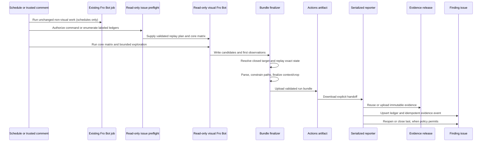
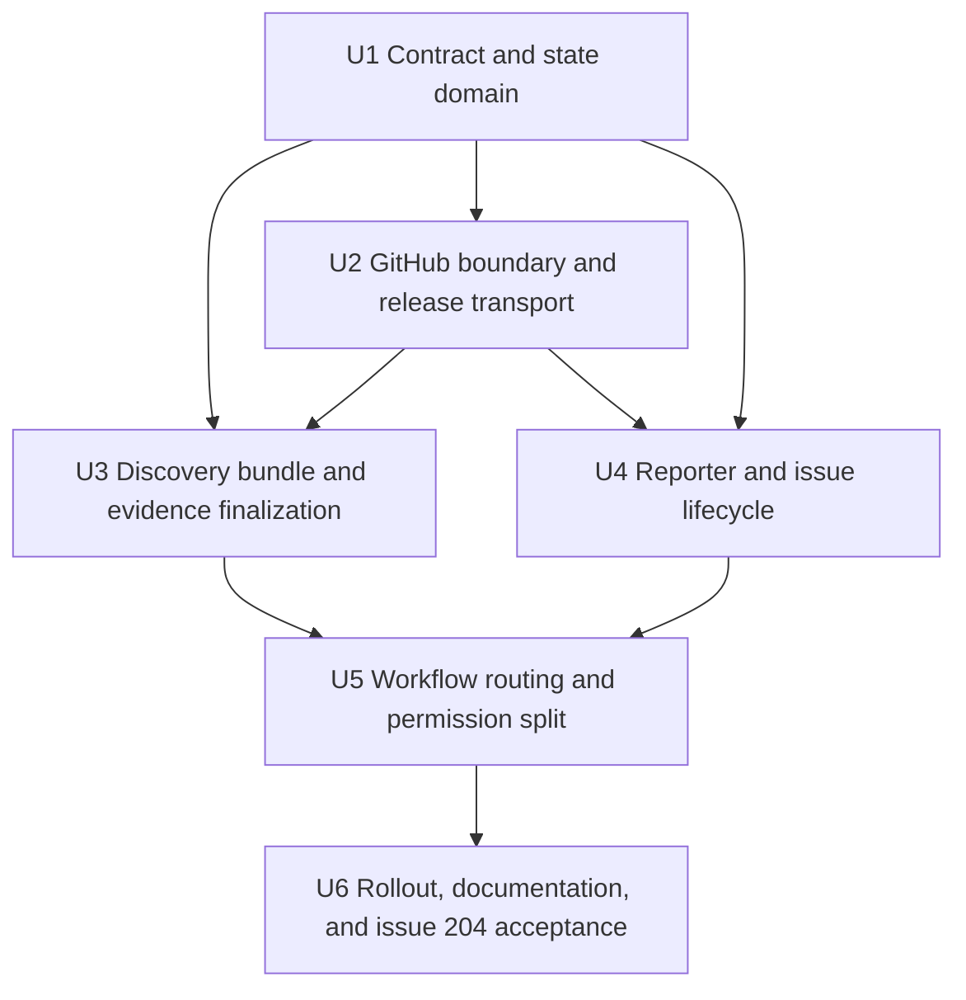
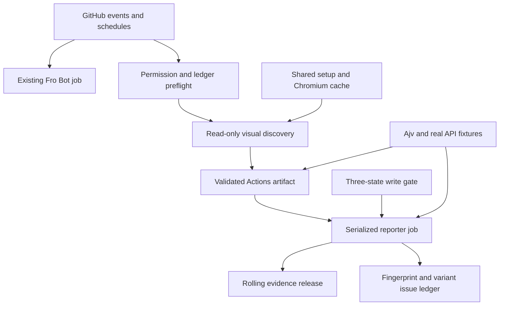

# feat: Add evidence-backed live audits

## Overview

Split scheduled visual/live discovery from GitHub reporting so Fro Bot can continue exploratory browser review without directly creating issues from runner-local evidence. A read-only discovery invocation will emit a versioned bundle; deterministic scripts will validate and finalize its screenshots, promote only confirmed findings to a rolling GitHub Release, and maintain one evidence-backed issue per finding with independently tracked viewport/theme variants.

The plan covers the full origin scope: both existing schedules, authorized manual validation, same-run failure confirmation, two-clean scheduled closure, human closure authority, issue #204 adoption, and durable context/crop screenshots. Existing non-visual Fro Bot behavior remains in place through the current job and prompts (see origin: `docs/brainstorms/2026-07-20-live-audit-evidence-requirements.md`).

---

## Problem Frame

Issue [#204](https://github.com/marcusrbrown/marcusrbrown.github.io/issues/204) demonstrates two independent defects in the current production-site review. Its screenshot path points into a dead GitHub Actions runner, and its full-page image does not show the below-fold project card being reported. The current `AUTOHEAL_PROMPT` asks one broadly privileged Fro Bot invocation to discover, capture, deduplicate, and publish findings, so no deterministic step can validate evidence before GitHub mutation.

The target architecture keeps agent judgment where it adds value—novel visual discovery—but moves file validation, release publishing, issue identity, retries, authorization, and state transitions into testable TypeScript scripts. This is a new CI/GitHub integration boundary with no direct repository precedent, so real payload fixtures, explicit timeout behavior, and post-merge live verification are required.

---

## Requirements Trace

| ID  | Plan responsibility                                                                                        |
| --- | ---------------------------------------------------------------------------------------------------------- |
| R1  | U5 routes only scheduled/manual visual findings into the new path; generic Fro Bot keeps other categories. |
| R2  | U3 is read-only discovery; U5 prevents source mutation and uses scoped tokens.                             |
| R3  | U5 runs visual discovery on both existing cron entries and exact authorized validation commands.           |
| R4  | U3 covers the four public routes at existing canonical desktop/mobile viewports in light/dark.             |
| R5  | U3 derives one named preset from the UTC schedule slot without persistent rotation state.                  |
| R6  | U3 preserves a bounded Fro Bot exploratory pass after deterministic core coverage.                         |
| R7  | U3 emits and validates a run artifact; U5 hands it to the separate reporter job.                           |
| R8  | U1 defines the versioned finding, observation, replay, variant, and evidence contract.                     |
| R9  | U1/U3 parse and validate the bundle before U4 may perform any write.                                       |
| R10 | U3 finalizes viewport context and target crop evidence with text/alt metadata.                             |
| R11 | U1 classifies responsive findings; U3 captures the canonical counterpart when required.                    |
| R12 | U3 captures comparable frames; U4 renders evidence in the required failure-to-clean order.                 |
| R13 | U5 uploads complete run bundles only as time-limited Actions artifacts.                                    |
| R14 | U2/U5 publish immutable assets to one serialized rolling release and retain referenced assets.             |
| R15 | U2 verifies retrievable image bytes before U4 writes issue evidence.                                       |
| R16 | U1 computes stable finding fingerprints and separate variant keys.                                         |
| R17 | U1/U4 own the compact issue-body ledger and human-readable initial report.                                 |
| R18 | U4 updates matching variants and separates materially different failure signatures.                        |
| R19 | U5 verifies the issue-local command and current repository write permission before discovery.              |
| R20 | U3/U4 replay every active variant from reporter-owned metadata and reject malformed state.                 |
| R21 | U1/U4 persist and evaluate two-clean scheduled counts per active variant.                                  |
| R22 | U3/U4 publish only confirmed failures and reset only the matching variant.                                 |
| R23 | U4 writes ordered final validation evidence and closure provenance.                                        |
| R24 | U4 reopens only reporter-closed findings and preserves human close/suppression decisions.                  |
| R25 | U1/U3 reconstruct URLs from the public route allowlist and reject off-origin redirects.                    |
| R26 | U5 gives discovery read-only access and reporter only release/issue write access.                          |
| R27 | U1/U3/U4 reject private/local data and keep sensitive values out of logs/evidence.                         |
| R28 | U1/U2/U4 derive operation keys and reconstruct completed checkpoints from GitHub state.                    |
| R29 | U2/U4 enforce the fixed validate → asset → issue → evidence → transition mutation order.                   |
| R30 | U1/U3 require two matching same-run observations before durable reporting.                                 |
| R31 | U1/U2/U4 use argument/file boundaries, contextual Markdown escaping, and verified links.                   |

---

## Scope Boundaries

- No restructuring of maintenance, pull-request review, or non-visual autoheal categories.
- No source-code remediation, branches, pull requests, merges, or deployments from visual discovery.
- No replacement of Fro Bot's exploratory judgment with a Playwright-first anomaly detector.
- No external database, object store, Pages evidence gallery, issue attachment workaround, or Git LFS evidence delivery.
- No permanent storage for clean run bundles; only confirmed failure and validation evidence is promoted.
- No all-presets matrix; one deterministic preset rotates through successive scheduled audits.
- No new package dependency; existing Ajv, Playwright, Node, `gh`, and Actions primitives are sufficient.
- No automatic reopening after a human close, `not planned`, duplicate, or explicit suppression decision.
- No inference of executable replay inputs from legacy issue prose.

### Deferred to Separate Tasks

- Automated release-asset garbage collection: defer until evidence volume proves a maintenance need; linked assets remain durable by default.
- Migration of non-visual Fro Bot findings to structured manifests: separate future initiative after the visual path is proven.
- Historical gallery or trend dashboard for clean visual runs: separate product decision, not required for actionable issue evidence.

---

## Context & Research

### Relevant Code and Patterns

- `.github/workflows/fro-bot.yaml` — one existing `fro-bot` job handles all events with broad job permissions; `AUTOHEAL_PROMPT` category 4 currently performs production review and creates issues directly.
- `.github/actions/setup/action.yaml` — shared Node/pnpm/Playwright setup and browser caching; the visual job must enable Chromium for both schedules and manual validation.
- `.agents/skills/agent-browser/SKILL.md` — current navigation, snapshot, full/annotated screenshot, and screenshot-diff contract. Explicit target-crop behavior is not documented and must be characterized before relying on it.
- `playwright.config.ts` and `tests/visual/` — existing canonical viewport/theme conventions and Playwright 1.61.1 support; the evidence finalizer may use native locator screenshots without adding image-processing dependencies.
- `src/utils/schema-validation.ts` — established Ajv parse/diagnostic pattern for untrusted JSON.
- `scripts/project-preview-refresh.ts` — validate-before-publish, bounded fetches, PNG magic-byte validation, deterministic filenames, staging, and fail-safe publication.
- `scripts/apply-repo-settings.ts` and `scripts/branch-protection-api.ts` — argument-array `gh` subprocess boundary and JSON-via-stdin pattern.
- `tests/scripts/project-preview-refresh.test.ts`, `tests/scripts/blog-refresh.test.ts`, and `tests/scripts/configure-branch-protection.test.ts` — script-level Vitest location and dependency-injection conventions.

### Institutional Learnings

- `docs/solutions/integration-issues/gist-list-api-omits-content-snapshot-empty-2026-07-18.md` — convenient fixtures and green CI did not prove the real GitHub contract. Use recorded real payload shapes, fail on missing/partial data, bound network calls, and preserve prior good state on failure.
- Visual artifact presence is not evidence correctness. Browser verification must prove that public URLs return image bytes and that screenshots actually contain the reported target.
- No direct repository precedent exists for release-asset publishing, multi-step issue mutation, or cross-run variant state. These surfaces require explicit first-principles tests rather than assumed local convention.

### External References

- [GitHub Actions workflow syntax: permissions and concurrency](https://docs.github.com/en/actions/reference/workflows-and-actions/workflow-syntax)
- [GitHub Actions concurrency control](https://docs.github.com/en/actions/how-tos/write-workflows/choose-when-workflows-run/control-workflow-concurrency)
- [GitHub Actions artifacts REST contract](https://docs.github.com/en/rest/actions/artifacts)
- [GitHub REST API: release assets](https://docs.github.com/en/rest/releases/assets)
- [GitHub REST API: releases](https://docs.github.com/en/rest/releases/releases)
- [GitHub REST API: issues](https://docs.github.com/en/rest/issues/issues)
- [GitHub REST API: issue comments](https://docs.github.com/en/rest/issues/comments)
- [GitHub Actions `issue_comment` event](https://docs.github.com/actions/using-workflows/events-that-trigger-workflows#issue_comment)
- [`fro-bot/agent` action contract](https://github.com/fro-bot/agent/blob/main/action.yaml) — v0.93.1 exposes session/cache/duration outputs, not an arbitrary-file output contract.

---

## Key Technical Decisions

- KTD1. **Add a dedicated visual Fro Bot invocation inside the existing workflow.** Both cron runs keep their current generic Fro Bot job and add an independent read-only visual discovery job. This accepted cost preserves non-visual behavior while giving the visual path a real permission boundary; the generic job explicitly excludes exact visual-validation commands.
- KTD2. **Use an explicit artifact handoff, not action outputs or assumed cross-job workspace state.** Fro Bot writes beneath a run-scoped directory in the same job; a deterministic finalizer validates it before `upload-artifact`; the reporter receives only the downloaded artifact. The privileged reporter extracts into a fresh directory and independently repeats schema, archive-entry, realpath, file-type, image-byte, dimension, and content-hash validation before any write. Neither same-job files nor the upstream finalizer's verdict are trusted across the permission boundary.
- KTD3. **Keep Fro Bot responsible for candidate discovery; make the deterministic finalizer own confirmation.** The agent proposes a normalized finding and closed replay intent. The finalizer reconstructs the allowlisted route, viewport, theme, and state; resolves a closed target descriptor; performs the second same-run observation; and captures the canonical context/crop pair. Only machine-observable finding kinds that the finalizer can reproduce become durable. Subjective or unresolvable exploratory findings remain workflow diagnostics.
- KTD4. **Parse the manifest with Ajv into a closed domain contract.** Untrusted JSON enters as `unknown`; a versioned schema defines finding signatures, observations, replay inputs, responsive classification, evidence roles, and variant keys. Path containment, URL allowlisting, control-character stripping, and file/image validation remain separate semantic gates after schema parsing.
- KTD5. **Use an injected, bounded `gh` CLI runner for GitHub mutations.** Argument arrays and input files avoid shell interpolation, while the existing repository pattern avoids a new SDK dependency. Every invocation has a timeout, bounded captured output, redacted diagnostics, and typed parsing of real response fixtures.
- KTD6. **Use one published `live-audit-evidence` release with immutable assets.** Asset names include stable identity, operation identity, role, and content hash. The reporter lists before upload, reuses verified matches, removes incomplete `starter`/zero-byte collisions, and never overwrites a valid linked asset.
- KTD7. **Serialize all reporter mutations with the current multi-pending queue contract.** A static reporter concurrency group uses `cancel-in-progress: false` and `queue: max`, which current GitHub Actions documentation defines as one active plus up to 100 pending runs. This is a bounded serialized queue, not permanent state: operation idempotency and GitHub state reconciliation remain mandatory, and queue-capacity failures must be visible and manually retryable.
- KTD8. **Keep canonical state in one bounded issue-body ledger; keep history in comments.** The reporter owns a sentinel-delimited compact ledger containing fingerprint, active variants, canonical replay inputs, clean counts, operation checkpoints, and transition provenance. Initial evidence remains in the body; later detections/validations use idempotent comments, preventing unbounded body growth while preserving a readable timeline. New report issues carry stable `fro-bot` and `visual-audit` labels so read-only discovery can enumerate ledgers without search-index timing assumptions.
- KTD9. **Separate finding identity from observed variants.** Route + semantic target + normalized failure signature identify the issue. Viewport + theme + reproduction state identify variants within it. Closure evaluates every active variant; different signatures on the same target remain separate issues.
- KTD10. **Make the mutation sequence externally recoverable without claiming atomic issue-body writes.** Deterministic operation keys appear in asset names, the issue ledger, and event comments. Before a body patch, the reporter re-reads the issue and merges only its sentinel into the latest body; after the patch, it immediately verifies the operation key, ledger, and outside-sentinel content against the pre-write state. Unexpected drift stops all later mutations and emits a recovery diagnostic. GitHub provides no atomic compare-and-swap for issue bodies, so a narrow concurrent human-edit race remains accepted and documented rather than hidden.
- KTD11. **Treat human issue resolution as authoritative.** Only an issue whose ledger records a matching reporter close operation may be automatically reopened. Human closers, `not planned`, duplicate resolution, missing/tampered ledger state, or explicit suppression produce diagnostics without issue mutation.
- KTD12. **Adopt issue #204 through a one-time trusted seed, not prose parsing.** Before the normal validation command is exercised, a manually reviewed temporary manifest initializes #204's canonical replay ledger through the same reporter contract. The seed is an operational artifact, not a committed permanent special case.
- KTD13. **Derive preset rotation without cross-run storage.** The two fixed UTC schedule slots map deterministically across the 12 presets, so successive scheduled audits rotate while manual runs do not perturb the sequence.
- KTD14. **Bound every external/browser operation.** Browser navigation, network-idle waits, Fro Bot execution, artifact transfer, `gh` calls, asset verification, and issue reads/writes all have explicit deadlines and fail-loud diagnostics; the current unlimited action timeout is not retained for visual discovery.
- KTD15. **Use a closed target descriptor, never executable selector prose.** The manifest may identify targets only through a small versioned union such as accessible role/name, normalized text anchor, repository-owned test identifier, or bounded viewport region. Arbitrary JavaScript, XPath, foreign URLs, file paths, and free-form CSS are excluded. Zero matches, ambiguous matches, detached nodes, and zero-size boxes reject the finding; the normalized semantic target—not the executable descriptor—remains part of issue identity.
- KTD16. **Authorize manual validation from current repository permission and issue locality.** `author_association` is only a coarse prefilter. Before checkout, browser startup, or secret-bearing agent execution, a secret-free preflight verifies the commenter's current repository permission is `write`, `maintain`, or `admin`, confirms the comment is on a non-PR issue, and requires the command's issue number to equal the event issue number. The fixed checked-in prompt receives only a parsed replay-plan file; raw comment bodies, issue prose, and user-supplied prompt text are never interpolated into the agent prompt.
- KTD17. **Ship write behavior behind explicit repository variable `LIVE_AUDIT_WRITE_MODE`.** The first merge defaults to `disabled` (discovery/finalizer/reporter decision dry-runs only); `manual-only` permits explicitly approved issue validation/adoption while schedules remain dry-run; `enabled` permits both scheduled and manual writes. Emergency rollback disables writes first, then reverts code if needed; disabling never deletes already referenced evidence.

---

## Open Questions

### Resolved During Planning

- Scheduled cost: retain the existing non-visual invocation and add a second read-only visual invocation on both schedules.
- Workflow placement: extend `.github/workflows/fro-bot.yaml`; do not add a second workflow file.
- Durable host: one published rolling GitHub Release; Actions artifacts remain handoff/debug-only.
- State store: issue-body ledger plus human-readable comments; no external database or label-based variant state.
- Screenshot strategy: agent-browser first, Playwright locator screenshot fallback, no new native image dependency.
- Manual target: validate the deployed production site at `https://mrbro.dev`, never a local preview.
- Legacy adoption: seed #204 from a trusted reviewed descriptor before invoking normal validation.
- GitHub boundary: injected `gh` runner with arguments/files and real-payload fixtures.
- Manual authorization: verify current repository permission and require the command to target the issue receiving the comment; association metadata alone is insufficient.
- Rollout posture: first merge is write-disabled, then manual-only #204 acceptance, then scheduled writes after explicit go/no-go review.
- Issue-body concurrency: preserve the confirmed body-ledger design with serialized reporters, fresh-read/merge, immediate post-write verification, and an explicitly accepted narrow race with concurrent maintainer edits.

### Deferred to Implementation

- Exact `agent-browser` explicit-path and element-screenshot behavior: characterize against the installed CLI before selecting its direct-capture path; Playwright fallback is already planned.
- Exact semantic target and replay variants for #204: inspect the current live issue/page immediately before producing the temporary seed; no behavior may be inferred from stale prose alone.
- Final timeout values and exploratory interaction budget: choose from measured core-matrix runtime while preserving explicit finite upper bounds.
- Exact compact ledger encoding and schema version field names: implementation detail; sentinel ownership, bounded size, parse failure, and state semantics are fixed by this plan.

---

## Output Structure

```text
.github/
  prompts/
    fro-bot-live-audit.md
  workflows/
    fro-bot.yaml                         # modify
scripts/
  live-audit/
    contract.ts
    evidence.ts
    finalize-discovery.ts
    github-runner.ts
    identity.ts
    ledger.ts
    reporter.ts
    route-event.ts
tests/
  e2e/
    live-audit-evidence.spec.ts
  scripts/
    fixtures/live-audit/
    live-audit-contract.test.ts
    live-audit-evidence.test.ts
    live-audit-github.test.ts
    live-audit-identity-ledger.test.ts
    live-audit-reporter.test.ts
    live-audit-routing.test.ts
```

This tree declares the expected module boundaries. Unit file lists remain authoritative, and implementation may combine helpers when doing so preserves the tested contracts without creating a grab-bag module.

---

## High-Level Technical Design

> This illustrates the intended approach and is directional guidance for review, not implementation specification. The implementing agent should treat it as context, not code to reproduce.



Manual validation enters the same ledger-preflight/discovery/finalizer/reporter path after strict actor, current-permission, command, and issue-number authorization. The generic Fro Bot job is excluded for that command. Scheduled discovery enumerates open `visual-audit` ledgers before browser work. Clean observations update only the matching variant's count; issue closure occurs only after every active variant satisfies the applicable threshold.

---

## Implementation Units



### U1. Define the manifest, identity, and ledger domain

- [ ] **Goal:** Establish one parse-don't-trust contract for discovery bundles, finding identity, variants, replay state, evidence roles, operation keys, and the bounded issue ledger.
- **Requirements:** R8-R9, R11, R16-R17, R21, R25, R27-R28, R30-R31.
- **Flows / acceptance:** F5; AE2, AE3, AE11, AE12, AE14.
- **Dependencies:** None.
- **Files:**
  - Create `scripts/live-audit/contract.ts`
  - Create `scripts/live-audit/identity.ts`
  - Create `scripts/live-audit/ledger.ts`
  - Create `tests/scripts/live-audit-contract.test.ts`
  - Create `tests/scripts/live-audit-identity-ledger.test.ts`
  - Create real-shape/redacted fixtures under `tests/scripts/fixtures/live-audit/`
- **Approach:**
  - Define a versioned Ajv schema whose parser accepts `unknown` and returns a discriminated domain value only after structural validation.
  - Keep semantic validation separate: route allowlist, closed target descriptors, responsive classification, canonical evidence roles, relative-path containment, and safe text limits.
  - Define the target descriptor as a closed union with deterministic match rules; arbitrary scripts, free-form selectors, and prose-derived executable values never enter the browser adapter.
  - Normalize a failure signature independently from human prose. Derive a finding fingerprint from route/target/signature and a variant key from viewport/theme/reproduction state.
  - Render and parse one sentinel-owned compact issue ledger while preserving all human-authored body content outside the sentinel. Enforce a body-size budget below GitHub's limit.
  - Derive deterministic operation keys for each run/fingerprint/variant/checkpoint; do not use timestamps or prose as identity.
- **Execution note:** Implement test-first using malformed and real-shape fixtures before exposing any parser to workflow input.
- **Patterns to follow:** `src/utils/schema-validation.ts` for Ajv diagnostics; `scripts/project-preview-refresh.ts` for total validators and deterministic names.
- **Test scenarios:**
  - **Happy path:** Parse an empty clean-run manifest and a confirmed-finding manifest with two matching observations, context/crop evidence, and one variant.
  - **Schema failure:** Reject unknown schema versions, missing observations, invalid viewport/theme values, extra executable fields, and non-string metadata without coercion.
  - **Path safety:** Reject absolute paths, traversal, symlink escape candidates, runner-temp paths, and screenshot references outside the run root.
  - **Origin safety:** Accept only normalized configured routes; reject absolute/foreign URLs and replay metadata that attempts to expand the allowlist.
  - **Target descriptors:** Parse allowed role/name, text-anchor, repository-owned identifier, and bounded-region variants; reject executable, ambiguous, unsupported, or oversized descriptors.
  - **Confirmation:** Accept a candidate only when the deterministic replay produces the same normalized signature despite prose differences; reject disagreement, missing replay, or infrastructure-error observations.
  - **Identity:** Keep a fingerprint stable across run IDs, timestamps, wording, and screenshot names; split materially different signatures; keep viewport/theme variants separate beneath one fingerprint.
  - **Ledger round trip:** Parse and re-render variants, clean counts, replay inputs, operation keys, and transition provenance without changing surrounding issue prose.
  - **Ledger failure:** Reject missing, duplicate, malformed, oversized, unsupported-version, or inconsistent sentinel state rather than repairing it heuristically.
  - **Text safety:** Strip control characters, bound text lengths, and contextually escape Markdown/image alt text without changing the normalized identity.
- **Verification:** Every later unit consumes only U1 parsers/types; no `JSON.parse` result, issue prose, event text, or file path bypasses the domain boundary.

### U2. Build the bounded GitHub and release transport

- [ ] **Goal:** Provide an injectable, timeout-bounded GitHub boundary for release assets, issues, comments, labels/state reasons, and close-event provenance.
- **Requirements:** R14-R15, R24, R26-R29, R31.
- **Flows / acceptance:** F5; AE2, AE11, AE15.
- **Dependencies:** U1 identity and operation-key contracts.
- **Files:**
  - Create `scripts/live-audit/github-runner.ts`
  - Extend fixtures under `tests/scripts/fixtures/live-audit/`
  - Create `tests/scripts/live-audit-github.test.ts`
- **Approach:**
  - Wrap `gh` as an injected asynchronous process runner using argument arrays and JSON/body files, with finite timeout, bounded stdout/stderr, and redacted error reporting.
  - Parse every CLI/API response from `unknown` through narrow response guards based on recorded real GitHub payloads.
  - Locate or create the published rolling release, list assets before upload, require explicit image content type, and verify downloaded bytes/content after upload.
  - Reuse exact immutable assets through a deterministic operation/fingerprint/variant prefix plus content hash; detect and remove only incomplete `starter`, zero-byte, hash-mismatched, or otherwise unverifiable collisions before retry.
  - Expose read operations for existing issues, comments, labels, collaborator permissions, and close events plus mutation operations for body/comment/state updates without embedding lifecycle policy in this transport layer.
  - Require a fresh issue read immediately before every body mutation so the caller can merge the sentinel ledger into the latest human-authored body and detect stale state.
- **Execution note:** Start with failing fake-runner contract tests for timeout, malformed JSON, partial upload, and duplicate-name behavior.
- **Patterns to follow:** `scripts/apply-repo-settings.ts` and `scripts/branch-protection-api.ts` for argument-safe `gh`; `scripts/project-preview-refresh.ts` for timeout and PNG validation.
- **Test scenarios:**
  - **Release lookup:** Reuse the existing published release; create it only when absent; reject a draft/private or recreated release that would invalidate known links.
  - **Asset upload:** Upload PNG evidence with immutable name and expected content type; return only a verified public download URL.
  - **Idempotent retry:** Reuse an existing asset with matching name/hash/size; do not upload twice.
  - **Partial asset:** Remove and retry a `starter`, zero-byte, truncated, or hash-mismatched asset; never delete a valid linked asset.
  - **Duplicate response:** Recover from duplicate-name behavior by re-reading state rather than blindly clobbering.
  - **Network/process failure:** Timeout, non-zero exit, oversized output, malformed JSON, and missing fields fail with bounded redacted diagnostics.
  - **Issue reads:** Parse open/closed state, state reason, body, comments, labels, and close-event actor from real-shape fixtures; fail closed when provenance is unavailable for a reopen decision.
  - **Permission reads:** Distinguish current `read`/`triage` permission from `write`/`maintain`/`admin` even when event association metadata appears trusted.
  - **Fresh-write boundary:** A body changed after the reporter's initial decision is re-read and merged without dropping human edits; incompatible ledger drift aborts the operation.
  - **Argument safety:** Hostile Markdown, control characters, filenames, and comment text never become shell syntax or CLI flags.
- **Verification:** Transport tests prove real response shapes and all documented release failure modes; no test depends on a richer fake payload than GitHub returns.

### U3. Produce and finalize read-only discovery bundles

- [ ] **Goal:** Keep Fro Bot's visual discovery capability while guaranteeing a validated, target-visible, same-run-confirmed bundle before any privileged job executes.
- **Requirements:** R1-R13, R20, R22, R25, R27, R30-R31.
- **Flows / acceptance:** F1, F3, F4; AE1, AE2, AE4, AE5, AE9, AE12, AE14.
- **Dependencies:** U1 contract; U2 read-only GitHub operations for manual/scheduled replay metadata.
- **Files:**
  - Create `.github/prompts/fro-bot-live-audit.md`
  - Create `scripts/live-audit/evidence.ts`
  - Create `scripts/live-audit/finalize-discovery.ts`
  - Create `tests/scripts/live-audit-evidence.test.ts`
  - Create `tests/e2e/live-audit-evidence.spec.ts`
  - Add evidence fixtures under `tests/scripts/fixtures/live-audit/`
- **Approach:**
  - Give the visual Fro Bot invocation a bounded report-only prompt that covers the canonical route/viewport/light/dark matrix, the stateless rotating preset, active issue replays, and a capped exploratory pass. U5 loads this checked-in prompt explicitly; it is not an orphaned documentation file.
  - Before agent execution, enumerate open `visual-audit` issues through U2, parse only reporter-owned ledgers, and build a read-only replay plan. Manual validation targets exactly the issue receiving the command.
  - Treat the agent's first observation as a candidate, not confirmation. Reconstruct the closed replay intent and require the deterministic finalizer to produce the second observation and matching normalized signature.
  - Write all provisional files beneath a run-scoped repository workspace directory. After the action returns, the finalizer parses the manifest, resolves only contained files, and writes a canonical artifact directory.
  - Characterize the installed `agent-browser` explicit-path/target screenshot contract first. Use it when proven; otherwise use existing Playwright locator screenshots to resolve the closed target descriptor and capture comparable viewport context and target crop. Reject zero/multiple/ambiguous/detached/zero-size targets—never relabel a full-page image as a crop.
  - Reconstruct `https://mrbro.dev` URLs from normalized routes, enforce same-origin redirects, and apply finite browser/navigation/network-idle deadlines.
  - For manual validation, consume only reporter-owned ledger/replay data fetched through U2. For scheduled validation, include every active variant; malformed/missing ledgers produce diagnostics and no mutation request.
- **Execution note:** Characterize the current browser CLI before adapter implementation, then build finalization test-first around the fallback-neutral evidence contract.
- **Patterns to follow:** `.agents/skills/agent-browser/SKILL.md`; `playwright.config.ts`; `tests/visual/utils.ts`; existing reduced route/theme matrices in Playwright suites.
- **Test scenarios:**
  - **Core coverage:** A run request enumerates every configured route at canonical desktop/mobile light/dark states and one deterministic scheduled preset.
  - **Preset rotation:** A stateless mapping from UTC day plus the fixed 03:30/15:30 schedule slot selects successive presets; manual runs do not advance or alter the mapping.
  - **Exploration bound:** Exploration cannot skip core states and cannot exceed its configured interaction/time budget.
  - **Confirmed finding:** Agent candidate plus deterministic exact-state replay with the same normalized signature produce one canonical context/crop bundle.
  - **Flake gate:** Clean/disagreeing/failed replay produces diagnostics only and no reportable finding or promoted files.
  - **Target framing:** Context includes page surroundings; a closed descriptor resolves exactly one non-zero target; crop contains that target; alt/caption metadata names route, viewport, theme, target, and result.
  - **Responsive counterpart:** Layout/overflow/visibility/hit-target findings capture the canonical counterpart; uncertain classification defaults to capture.
  - **Crop fallback:** Unsupported agent crop uses Playwright locator capture; missing/detached/zero-size target rejects the finding rather than weakening evidence.
  - **Manual replay:** Every active variant from a valid reporter-owned ledger is replayed; malformed, absent, or ambiguous metadata fails closed without parsing issue prose.
  - **Origin/redirect:** Allowlisted production routes pass; foreign URL, off-origin redirect, local address, and issue-supplied absolute URL fail.
  - **Browser failure:** Launch, navigation, network-idle, screenshot, and close timeouts fail loudly while leaving no reportable partial bundle.
  - **Real browser evidence:** A controlled page fixture demonstrates a visible broken image/overflow target and produces independently inspectable context/crop PNGs.
- **Verification:** The canonical artifact is sufficient for reporting without access to the agent session or runner temp directory; screenshots are inspected in a real browser, not only checked for existence.

### U4. Implement idempotent issue reporting and lifecycle

- [ ] **Goal:** Turn one validated artifact into recoverable release/issue mutations while preserving variant state, closure policy, and human authority.
- **Requirements:** R12, R15-R24, R27-R31.
- **Flows / acceptance:** F1-F5; AE1, AE3, AE5-AE8, AE10-AE11, AE15.
- **Dependencies:** U1 domain and ledger; U2 GitHub transport.
- **Files:**
  - Create `scripts/live-audit/reporter.ts`
  - Create `tests/scripts/live-audit-reporter.test.ts`
  - Extend fixtures under `tests/scripts/fixtures/live-audit/`
- **Approach:**
  - Extract the downloaded artifact into a fresh reporter-owned directory and re-parse/revalidate it from scratch before constructing a decision. Reject traversal entries, symlinks/hardlinks/device files, realpath escape, changed image bytes/dimensions, and content-hash mismatch across the read-only-to-privileged boundary.
  - Implement a pure decision layer that compares the independently validated run against current release/issue state and produces the next checkpoint; keep U2 responsible for execution.
  - Follow the fixed order: validate, derive immutable assets/operation keys, upload+verify/reuse, locate/create issue, upsert the run evidence/ledger, then transition state last.
  - Create initial issues with text symptom/reproduction context and ordered failure context/crop evidence. Keep the compact sentinel ledger canonical; write repeat/validation evidence as one idempotent human-readable comment per operation key.
  - Maintain independent active variants and consecutive-clean counts. Manual validation closes after all variants are clean once; scheduled validation closes after all variants are clean twice; confirmed recurrence resets only its variant.
  - Immediately before body mutation, re-read the issue, merge only the reporter sentinel into the latest human-authored body, and capture the pre-write outside-sentinel hash/update marker. Immediately after mutation, re-read and verify the operation key, ledger, and outside-sentinel content; abort all later mutations and emit recovery diagnostics on drift.
  - Reopen only when current state and close-event provenance match the reporter's recorded auto-close operation. Treat all human closure/suppression states as terminal and surface confirmed suppressed recurrence prominently in the Actions summary without commenting on the issue.
  - Support dry-run decision output with full write parity and a generic trusted adoption operation so #204 can be seeded without permanent issue-specific code. The reporter's default is no writes; U5's rollout mode grants them.
- **Execution note:** Implement the decision engine test-first; add mutation execution only after state-transition and partial-write tables are green.
- **Patterns to follow:** issue-body bounding/archival discipline in `MAINTENANCE_PROMPT`; pure-build-then-publish separation in `scripts/project-preview-refresh.ts`.
- **Test scenarios:**
  - **Clean run:** Empty findings/validations create no release asset, issue, or comment.
  - **New finding:** Upload verified context/crop assets, create one issue, initialize one variant, and record operation checkpoint exactly once.
  - **Repeat variant:** Reuse the same issue, append one event comment, update last-seen state, and reset only that variant's clean count.
  - **New variant:** Add desktop/theme state beneath the existing fingerprint without merging its clean count or evidence with another variant.
  - **Different signature:** Same route/target with a materially different signature creates a separate issue.
  - **Scheduled closure:** First clean scheduled replay keeps the issue open; second per active variant closes only after all variants reach two.
  - **Manual closure:** One authorized clean replay of every active variant writes final evidence and closes.
  - **Partial clean:** Some variants clean and one failing keeps the issue open; only the confirmed failing variant resets.
  - **Automated recurrence:** Reporter-closed issue reopens and records new evidence once.
  - **Human authority:** Human close, `not planned`, duplicate, suppression, absent/tampered ledger, or unknown close provenance never reopens or comments.
  - **Ordered presentation:** Every initial report and validation comment uses failure context → failure crop → clean context → clean crop, omitting unavailable clean pairs rather than reordering; all frames include textual summaries, descriptive alt text, and verified links.
  - **Body bound:** Repeated runs keep compact state under budget because history remains in comments; body updates preserve human prose.
  - **Checkpoint retry:** Fail after each mutation boundary and rerun; existing assets/issues/comments are detected and no side effect duplicates.
  - **Untrusted artifact:** Reporter-side extraction rejects archive traversal, links, device entries, path escape, substituted image bytes, invalid dimensions, and mismatched hashes even when the discovery finalizer accepted the upstream bundle.
  - **Fresh issue merge:** A human body edit made between decision and mutation is preserved; incompatible ledger change aborts instead of overwriting.
  - **Post-write drift:** Simulated concurrent body change after the fresh read is detected by immediate verification; no comment or state transition follows, and diagnostics acknowledge the non-atomic race.
  - **Suppressed recurrence:** Confirmed recurrence after human closure changes no issue state/comment and emits a high-visibility Actions summary warning.
  - **Dry run:** Produce intended fingerprints, variants, asset names, comments, and transitions without calling a write operation; write-enabled mode derives the same decision set.
  - **Trusted adoption:** A valid local descriptor can initialize a legacy issue; untrusted issue prose is never parsed into replay inputs.
- **Verification:** A deterministic fixture can be replayed from every checkpoint to the same final release/issue state, and tests cover every closure/reopen branch.

### U5. Integrate workflow routing, permissions, artifacts, and concurrency

- [ ] **Goal:** Wire the read-only visual invocation and serialized reporter into the existing Fro Bot workflow without changing the required PR-review check or non-visual scheduled behavior.
- **Requirements:** R1-R7, R13-R14, R19-R20, R25-R26, R30.
- **Flows / acceptance:** F1, F3, F5; AE5, AE10, AE12-AE15.
- **Dependencies:** U3 canonical artifact; U4 reporter.
- **Files:**
  - Modify `.github/workflows/fro-bot.yaml`
  - Create `scripts/live-audit/route-event.ts`
  - Create `tests/scripts/live-audit-routing.test.ts`
- **Approach:**
  - Preserve the current `fro-bot` job name/check and broad behavior, but replace production-review prompt category 4 with a short delegation guard so it never duplicates the new path.
  - Load the fixed checked-in live-audit prompt explicitly into the visual action; pass only the parsed replay-plan file through the closed contract. Never interpolate raw event comments, issue prose, custom workflow prompt text, or manifest descriptions into the agent prompt.
  - Exclude exact visual-validation commands from the generic comment job. Route schedules plus strict trusted issue-comment commands to a secret-free preflight; reject PR comments, cross-issue numbers, near matches, bots, and actors whose current repository permission is below `write` before checkout, browser setup, or agent execution. Treat `author_association` only as an early coarse filter.
  - Run the visual action with the job-scoped read-only `github.token`, not the broad `FRO_BOT_PAT`; keep OpenCode/model credentials limited to the discovery job and set finite job/action deadlines.
  - Enable cached Chromium setup for both schedules and manual validation. Finalize and upload the canonical bundle explicitly; diagnostic-only rejected observations may remain in the ephemeral artifact but are marked non-reportable and can never be promoted.
  - Export whether the artifact contains any reportable failure or clean-validation operation. Skip the reporter only when a scheduled run has no operation; manual validation always reaches dry-run decision reporting.
  - Give reporter only `contents: write` and `issues: write`, no PR/discussion permission or agent credentials. Apply one static concurrency group with `cancel-in-progress: false` and `queue: max` so up to 100 pending reporter runs serialize instead of replacing one another.
  - Read the three-state write mode with default `disabled`: schedules and manual commands dry-run while disabled, only manual/adoption may write in `manual-only`, and all approved paths may write in `enabled`.
  - Ensure skipped/failed discovery cannot accidentally run reporter; preserve useful artifact/summary diagnostics without `continue-on-error` on deterministic gates.
- **Execution note:** Build routing fixtures before editing job conditions; workflow-expression mistakes can silently double-trigger privileged work.
- **Patterns to follow:** existing actor/fork guards and pinned actions in `.github/workflows/fro-bot.yaml`; `.github/actions/setup/action.yaml` for project/browser setup.
- **Test scenarios:**
  - **Schedule routing:** Both existing cron values run generic non-visual and dedicated visual jobs; visual reporter runs only after successful artifact handoff.
  - **Manual routing:** Exact authorized issue-local command whose number equals the event issue runs visual discovery/reporter and does not run generic Fro Bot.
  - **Current permission:** An actor with trusted association but only read/triage permission cannot reach checkout, browser, artifact, agent-secret, or reporter stages; write/maintain/admin may proceed.
  - **Prompt isolation:** Hostile Markdown/instructions in a valid command's surrounding issue body never enter the agent prompt; the agent receives only the fixed prompt and parsed replay-plan data.
  - **Near match:** Extra arguments, leading prose, mismatched issue number, malformed issue number, PR comment, discussion/review comment, bot author, and unauthorized actor run no discovery invocation, artifact handoff, or reporter job.
  - **Other comments:** Normal trusted `@fro-bot` comments continue to run the generic job unchanged.
  - **PR check stability:** Pull-request events still produce the required `Fro Bot` check under the same job name and review prompt.
  - **Permissions:** Discovery receives read-only GitHub access; reporter receives only release/issue writes; broad PAT and agent credentials never reach reporter.
  - **Artifact failure:** Missing, malformed, or failed discovery artifact skips/fails reporter without any GitHub mutation.
  - **No-operation gate:** Scheduled clean run with no open-issue validation skips reporter; scheduled/manual clean validation still reaches reporter to update counts or close.
  - **Concurrency:** Scheduled and manual reporters serialize with multi-pending queue semantics, no active cancellation, and visible failure when the documented pending capacity is exceeded.
  - **Rollout modes:** Missing/disabled mode performs zero writes; manual-only rejects scheduled writes; enabled permits both; dry-run and write-enabled decisions are identical before execution.
  - **Timeout:** Hung visual discovery terminates within the configured bound and cannot leave a reporter-eligible partial artifact.
  - **Workflow validation:** YAML, pinned actions, `needs`/`if` chains, and skip behavior pass repository lint/type checks and a manual dry-run dispatch after merge.
- **Verification:** Existing PR-review, autoheal, and maintenance routes remain observable and unchanged outside delegated production review; no validation command can trigger both jobs.

### U6. Document operations and validate issue #204 end to end

- [ ] **Goal:** Prove the deployed workflow with durable public evidence and leave an auditable operating path for future failures/retries.
- **Requirements:** All success criteria, especially durable evidence, no local paths, deduplication, closure policy, and #204 acceptance.
- **Flows / acceptance:** F3, F5; AE5, AE8, AE11-AE13, AE15.
- **Dependencies:** U5 merged to the default branch; GitHub requires default-branch workflow code for comment-triggered execution.
- **Files:**
  - Create `docs/live-audit-evidence.md`
  - Update `.github/ACTIONS.md`
  - Update `scripts/AGENTS.md`
  - Update `tests/AGENTS.md` if the new script/E2E layout changes its inventory
- **Approach:**
  - Document triggers, write modes, permission boundaries, artifact versus release retention, ledger ownership, retry/checkpoint behavior, human closure override, diagnostics, queue capacity, and emergency disable procedure.
  - Merge with writes disabled. Verify default-branch discovery, artifact, and reporter-decision dry-run before changing the write mode.
  - Before any #204 mutation, capture a read-only baseline of issue state, labels/state reason, close/reopen provenance, existing sentinel/evidence, and human suppression. Stop for explicit maintainer direction when provenance is ambiguous or human authority already resolved the issue.
  - Produce a temporary trusted replay descriptor and dry-run its exact intended ledger adoption. After explicit approval, switch to manual-only, seed #204 through reporter adoption, then exercise the normal issue-local validation command.
  - Let observed production state decide whether #204 receives fresh failure evidence and stays open or receives clean evidence and closes. Enable scheduled writes only after #204 evidence, idempotent retry, required-check, and non-visual behavior gates pass.
  - Verify release asset URLs independently return image bytes and inspect the rendered issue comment/body to confirm target-visible context/crop, alt text, captions, ordering, and no runner-local paths.
  - Run one reporter retry against the same operation key to prove no duplicate asset/comment/state transition.
- **Execution note:** Runtime acceptance is post-merge and explicitly gated because it mutates public release/issue state; pre-merge verification must rely on dry-run and contract fixtures.
- **Test scenarios:**
  - **Dry-run dispatch:** Default-branch workflow produces a valid canonical artifact and reporter decision summary without durable writes.
  - **Dry-run parity:** Disabled and write-enabled evaluation derive the same fingerprints, variants, asset names, comments, and state transitions before execution.
  - **Legacy seed:** Trusted #204 descriptor initializes exactly one ledger without deriving any field from issue prose.
  - **Manual validation:** Authorized command replays every seeded active variant and follows the one-clean manual policy.
  - **Rendered evidence:** Public issue embeds load after the workflow completes, show the reported target in context/crop, and carry readable text/alt/captions.
  - **Idempotent rerun:** Same operation key creates no duplicate release asset, issue body event, comment, reopen, or close.
  - **Authorization smoke:** An unauthorized or malformed command produces no browser run or GitHub write.
  - **Existing automation:** Subsequent PR, maintenance, and autoheal runs retain their original required checks and non-visual behavior.
  - **Disable path:** Returning write mode to disabled, cancelling active reporter runs, and verifying no reporter remains active prevents further scheduled/manual mutation while discovery-only dry runs and existing evidence remain intact.
- **Verification:** Issue #204 contains working durable validation evidence and the correct open/closed state; the workflow run, rolling release, and issue timeline together prove the full contract. The next 03:30 and 15:30 UTC schedules, one normal PR, and the first 24 hours of write-enabled operation show no duplicate, authorization, evidence, required-check, or generic-Fro-Bot regression.

---

## System-Wide Impact



- **Interaction graph:** Existing schedule/comment routing fans into the unchanged generic job and the new visual lane. Only the reporter crosses into release/issue mutation; discovery cannot write either surface.
- **Error propagation:** Schema, browser, artifact, upload, verification, and GitHub mutation errors fail their job and surface a concise Actions summary. Reporter never interprets an incomplete upstream job as a clean audit.
- **State lifecycle risks:** Durable state spans release assets, issue body ledger, comments, issue state reason, and close-event provenance. Operation keys and fixed ordering are required to reconcile partial completion.
- **API surface parity:** Existing PR-review/maintenance/autoheal commands remain; the only new command is trusted issue validation. Manual and scheduled paths converge before finalization/reporting.
- **Integration coverage:** Unit fixtures prove contracts and transitions; Playwright proves target-visible screenshots; post-merge #204 validation proves Actions → Release → Issue behavior.
- **Unchanged invariants:** Required `Fro Bot` PR check name, non-visual prompts, default-branch safety, no direct pushes, no telemetry, application runtime/build output, and GitHub Pages deployment remain unchanged.
- **Operational cost:** Each schedule adds one Fro Bot invocation plus Chromium/browser work. This cost is accepted to obtain read-only isolation and durable evidence; no additional agent invocation is added to normal PR reviews.

---

## Risks & Dependencies

| Risk / dependency | Mitigation |
| --- | --- |
| Second scheduled Fro Bot invocation increases model/runner cost | Scope it to visual discovery, bound matrix/exploration/time, reuse cached Chromium, and report measured runtime in U6. |
| `fro-bot/agent` does not document arbitrary file outputs | Depend only on files verified after the action in the same job, then use explicit Actions artifacts across jobs; missing output fails U3. |
| `agent-browser` crop/path behavior differs from assumptions | Characterize first; use existing Playwright locator screenshot fallback; reject rather than publish incomplete evidence. |
| Agent-generated manifest is malformed or prompt-injected | Read-only token, closed Ajv schema, semantic/path/origin gates, no direct writes, and deterministic finalizer/reporter. |
| Agent repeats a mistaken visual interpretation | Agent proposes only the first candidate; deterministic closed-descriptor replay owns confirmation and keeps subjective/unreproducible findings diagnostic-only. |
| Release upload leaves duplicate or `starter` asset | List/reconcile before upload, immutable content-hashed names, verify bytes, delete only proven incomplete collisions, retry by operation key. |
| Reporter queue overflows or issue state changes during a run | Use `queue: max` for up to 100 pending runs, expose overflow for manual retry, re-read immediately before mutation, and retain operation idempotency. |
| Issue body becomes too large | Keep only compact current ledger + initial evidence in body; later history is idempotent comments; enforce a body budget before mutation. |
| Human close is misidentified as automation | Require matching ledger operation plus close-event provenance; unknown provenance fails closed and never reopens. |
| New workflow routing breaks required PR check | Preserve existing job name and PR path; isolate validation exclusions narrowly; test real event fixtures and verify PR checks after merge. |
| Comment-triggered workflow is unavailable until default-branch merge | Provide pre-merge dry-run/unit coverage; reserve live #204 acceptance for explicit post-merge rollout. |
| Public evidence accidentally exposes secrets/local state | Public-route-only browser profile, screenshot/path containment, control-character and log redaction, no authenticated/private session, manual inspection in U6. |
| Event association grants more trust than current permission | Query current collaborator permission before checkout or secrets; fail closed when the permission check is unavailable or below write. |
| Artifact changes across the read-only/privileged boundary | Reporter extracts in a fresh directory and independently repeats path, link, image, dimension, and content-hash validation before writes. |

---

## Documentation / Operational Notes

- `docs/live-audit-evidence.md` becomes the runbook for triggers, `LIVE_AUDIT_WRITE_MODE`, ledger ownership, evidence retention, retry/recovery, human suppression, and release maintenance.
- The rolling release is infrastructure evidence, not a product release. Its description should state that assets are machine-managed and must not be renamed or deleted while referenced.
- All GitHub body/comment writes must use file or JSON-input boundaries; no inline shell body interpolation.
- Workflow and public issue/release mutations require explicit approval during implementation. No automerge or automatic rollout is part of this plan.
- The plan's final gate is not merely green CI: it is a rendered, target-visible context/crop pair on issue #204 whose public URLs remain valid after the workflow runner exits.

### Phased Rollout

| Phase | Write mode | Go evidence | No-Go condition |
| --- | --- | --- | --- |
| Pre-merge | `disabled` | Unit/fixture/Playwright coverage, workflow validation, unchanged required-check design | Any test path can mutate GitHub or the required check becomes conditional on visual jobs |
| Default-branch dry run | `disabled` | Canonical artifact plus reporter decision summary with zero durable writes | Invalid artifact, skipped required replay, unsafe planned mutation, or non-zero write count |
| #204 adoption dry run | `disabled` | Trusted descriptor plans exactly one bounded ledger adoption | Any replay field comes from issue prose or unrelated issue content changes |
| #204 acceptance | `manual-only` | One approved seed and issue-local validation produce correct durable evidence/state | Broken URL, missing target, duplicate side effect, wrong transition, or human authority conflict |
| Scheduled activation | `enabled` | Both cron slots preserve generic behavior and perform clean no-op or correct idempotent mutation | Queue overflow, duplicate issue/asset/comment, required-check regression, or failure represented as clean |

Primary rollback is disable, cancel, verify, then revert if necessary. Set `LIVE_AUDIT_WRITE_MODE` to `disabled`, cancel every active reporter run, and verify no write-capable reporter remains before treating the kill switch as effective. Read-only discovery may remain available. Reverting workflow code does not undo public evidence; erroneous mutations require forward correction, and referenced assets remain intact.

### Post-Deploy Monitoring

Monitor at write enablement, after each cron slot, and after 24 hours:

| Signal | Stop / disable condition |
| --- | --- |
| Discovery/finalizer health | Any deterministic failure after write mode is enabled |
| Dry-run/write parity | A write was not represented in the prior decision summary |
| Asset integrity | Any public evidence URL fails image-byte/render verification |
| Idempotency | One operation key creates duplicate assets, comments, or transitions |
| Authorization | Any unauthorized command reaches checkout, browser, agent, artifact, or reporter |
| Issue identity | More than one open issue exists for one fingerprint or variants overwrite each other |
| Required check | `Fro Bot` is missing, renamed, skipped, or depends on visual jobs for a normal PR |
| Generic automation | Maintenance/autoheal/normal comment behavior no longer updates expected surfaces |
| Evidence quality | Any public report contains a runner path, expiring artifact URL, broken image, or targetless crop |
| Runtime/cost | Visual lane exceeds the rollout budget for two consecutive scheduled runs |

---

## Alternative Approaches Considered

- **Prompt-only screenshot upload:** Rejected because one freeform agent would still own discovery, storage, and issue mutation; #204's root boundary failure remains.
- **Playwright-first deterministic audit:** Rejected for the first version because it narrows discovery to known assertions. Playwright remains an evidence-capture fallback and future home for repeated objective finding classes.
- **Separate live-audit workflow file:** Rejected to preserve one Fro Bot event/schedule entry point and the existing required check. Job-level permissions provide the necessary isolation within the current workflow.
- **External state store:** Rejected as unnecessary operational surface. A compact issue ledger plus immutable release assets is auditable and sufficient.
- **GitHub Pages or Git LFS evidence:** Rejected because it couples evidence to deployment/history and repeats the broken-link/LFS problems already observed.
- **Issue comments as canonical state:** Rejected because reconstructing mutable variant state from an unbounded event stream is harder to make idempotent than replacing one bounded ledger block.

---

## Sources & References

- **Origin document:** `docs/brainstorms/2026-07-20-live-audit-evidence-requirements.md`
- **Acceptance issue:** [#204](https://github.com/marcusrbrown/marcusrbrown.github.io/issues/204)
- **Upstream reliability issue:** [fro-bot/agent#1252](https://github.com/fro-bot/agent/issues/1252)
- `.github/workflows/fro-bot.yaml`
- `.github/actions/setup/action.yaml`
- `.agents/skills/agent-browser/SKILL.md`
- `playwright.config.ts`
- `src/utils/schema-validation.ts`
- `scripts/project-preview-refresh.ts`
- `scripts/apply-repo-settings.ts`
- `scripts/branch-protection-api.ts`
- `tests/scripts/project-preview-refresh.test.ts`
- `docs/solutions/integration-issues/gist-list-api-omits-content-snapshot-empty-2026-07-18.md`
- [GitHub Actions workflow syntax](https://docs.github.com/en/actions/reference/workflows-and-actions/workflow-syntax)
- [GitHub Actions artifacts](https://docs.github.com/en/rest/actions/artifacts)
- [GitHub REST API: release assets](https://docs.github.com/en/rest/releases/assets)
- [GitHub REST API: issues](https://docs.github.com/en/rest/issues/issues)
- [GitHub REST API: issue comments](https://docs.github.com/en/rest/issues/comments)
- [`fro-bot/agent` action metadata](https://github.com/fro-bot/agent/blob/main/action.yaml)
