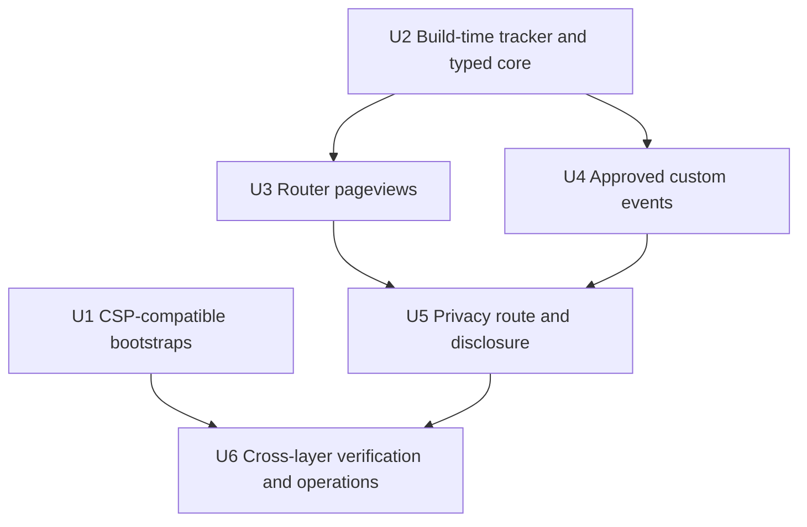

# feat: Add privacy-preserving Umami metrics

## Overview

Replace the dormant analytics manager with a thin typed Umami integration, make React Router the single pageview source, and expose only bounded categorical events. The site will add a truthful `/privacy` route and CSP-compatible script boundary while remaining fully functional when analytics is disabled, blocked by DNT, slow, or unavailable.

---

## Problem Frame

mrbro.dev currently carries a large consent, session, queue, error, performance, and generic-event abstraction that never sends production analytics. The code still observes visitors and retains stale APIs from removed surfaces, while anonymous runtime GitHub calls and similar dependencies have already shown why visitor-facing infrastructure should be minimized.

The existing self-hosted Umami service at `metrics.fro.bot` provides the approved aggregate analytics model, but the deployed tracker does not observe browser back/forward navigation. The site therefore needs an integration that owns SPA pageviews explicitly, keeps custom events categorical, and does not preserve the old manager's unsafe or unused machinery (see origin: `docs/brainstorms/2026-07-30-mrbro-dev-umami-metrics-requirements.md`).

The shared Umami deployment currently retains data indefinitely. Site integration can land disabled, but production activation is blocked until separate infrastructure work enforces 13-month retention and produces version-controlled verification evidence.

---

## Requirements Trace

| Origin | Plan response |
| --- | --- |
| R1-R3 | Load only the self-hosted tracker, only for configured production builds, with DNT suppression preserved. |
| R4-R7 | Strip search/hash data, prohibit visitor-authored or identifying payloads, keep analytics disabled until retention evidence exists, and publish `/privacy` globally. |
| R8 | Emit one normalized pageview per real React Router navigation, including browser back/forward, without same-path rerender duplicates. |
| R9-R12 | Retain fixed Home impressions and approved interaction families behind literal unions and committed snapshot/catalog validation. |
| R13-R16 | Drop the session/consent/queue/error/performance manager, remove raw URL/error/query payloads, and keep tracker failure non-fatal. |
| R17-R18 | Prove configured and unconfigured production builds behave correctly and keep event names dashboard-stable. |
| R19-R20 | Prove DNT blocks pageview/custom-event requests and make the typed event catalog the privacy inventory's source of truth. |
| R21 | Enforce a repository-controlled CSP that permits executable scripts and analytics connections only from self and `metrics.fro.bot`. |
| R22 | Keep activation revoked when retention ownership, processing, or policy changes invalidate prior evidence. |

### Acceptance Examples

| Case | Required outcome |
| --- | --- |
| Unconfigured build | No Umami script, no metrics requests, and no tracking failure affects the app. |
| Configured build | One tracker instance uses the public site ID and required privacy attributes. |
| DNT enabled | The static tracker may load, but no pageview or custom-event request is sent. |
| SPA navigation | Initial, link, replace, back, and forward navigation each produce one normalized pageview; same-path rerenders produce none. |
| Custom interaction | Only approved categorical events and properties reach the tracker; arbitrary payloads are not representable through the application API. |
| Missing or stale retention evidence | Production remains disabled and `/privacy` does not claim active analytics under an unverified policy. |
| Integration-ready milestone | The disabled integration, privacy page, CSP-compatible bootstraps, and full fixture verification can merge and deploy without enabling production collection. |
| Activation milestone | A separate approved operation sets the website ID only after revision-matched infra evidence and completes the live go/no-go checks. |

---

## Scope Boundaries

- No consent banner, cookie preference center, identity API, session stitching, fingerprinting, or visitor profile.
- No search text, raw URLs, query strings, hashes, error strings, performance values, hover events, or unbounded custom payloads.
- No runtime dependency on the infrastructure repository or Umami administration API.
- No dashboard provisioning, alerting, experiment framework, or telemetry pipeline beyond the approved Umami integration.
- No unrelated redesign of the header, footer, theme system, project cards, or blog cards.

### Delivery Milestones

- **Milestone 1 — integration-ready/disabled:** Complete U1-U6, merge the site changes, and verify production still emits no tracker or collector request while `UMAMI_WEBSITE_ID` is unset. This is the completion boundary for the code plan.
- **Milestone 2 — production activation:** After the separate infra task lands, review evidence for the currently deployed infra commit and Umami version, set the website ID, redeploy, and execute the documented live go/no-go and rollback checks.

### Deferred to Separate Tasks

- **Shared retention enforcement (`marcusrbrown/infra`):** Replace the current indefinite-retention posture with a tested 13-month cleanup mechanism and commit durable verification evidence.
- **Shared disclosure reconciliation:** Update Systematic and dev-like privacy disclosures after the server-wide retention policy is enforced.
- **Production activation:** Set the mrbro.dev `UMAMI_WEBSITE_ID` repository variable and redeploy only after the infrastructure evidence is reviewed.

---

## Context and Research

### Relevant Code and Patterns

- `src/utils/analytics.ts` and `src/hooks/UseAnalytics.ts` contain the dormant manager, the live section/project/navigation wrappers, and stale event families to replace.
- `src/pages/Home.tsx`, `src/components/SmoothScrollNav.tsx`, and `src/contexts/ThemeContext.tsx` are the current live analytics call sites.
- `src/components/Footer.tsx`, `src/components/Header.tsx`, `src/components/ProjectCard.tsx`, and `src/components/BlogPost.tsx` expose the approved contact, navigation, project, external-profile, and blog-open surfaces.
- `vite.config.ts` already centralizes build-time behavior; `.github/workflows/deploy.yaml` already scopes build variables to the build step.
- `index.html` and `public/404.html` contain inline executable bootstraps that must be made CSP-compatible without breaking theme preload or GitHub Pages SPA restoration.
- The current theme-preloader utility and tests provide characterization coverage; U1 moves that behavior into the exact public script artifact the browser executes and tests that artifact directly.
- `tests/e2e/base-path.spec.ts` is the existing GitHub Pages route/asset smoke surface; `tests/accessibility/page-audits.spec.ts` and the visual suites establish the required user-facing verification bar.

### Institutional Learnings

- `docs/solutions/integration-issues/github-pages-spa-404-route-navigation-2026-07-26.md`: non-root production verification must enter through the GitHub Pages redirect path and assert the restored pathname.
- `docs/solutions/integration-issues/gist-list-api-omits-content-snapshot-empty-2026-07-18.md`: external-service contracts need real-shape verification and fail-closed publication rather than green mocks that encode the wrong API.
- `docs/solutions/security/react-router-rsc-advisory-exception-2026-07-24.md`: keep the integration inside the existing client-only SPA boundary.
- Systematic and dev-like already use production-only, missing-ID-hard-disabled Umami tags with DNT, search, and hash exclusions; mrbro.dev should preserve that deployment posture without copying their framework-specific injection mechanisms.

### External Research

- The deployed `metrics.fro.bot/script.js` supports `data-auto-pageview`, DNT, search/hash exclusion, declarative event attributes, and `/api/send`, but currently hooks `pushState` and `replaceState` without `popstate`.
- Current Umami documentation supports declarative events and programmatic pageviews/custom events; manual route ownership must disable automatic pageviews to avoid duplicates.
- Vite exposes only `VITE_`-prefixed values to client builds and replaces them at build time; the website ID is intentionally public configuration, not a secret.
- GitHub Pages does not provide repository-controlled response headers, so CSP must use document metadata and its associated limitations.

---

## Key Technical Decisions

| Decision | Rationale |
| --- | --- |
| Replace the manager rather than retrofit it | The existing session, consent, queue, timing, search, error, download, and generic-payload machinery contradicts the approved model and has no production sender. |
| React Router owns pageviews | One route-aware source covers initial, push/replace, back/forward, and same-path deduplication; Umami automatic pageviews stay disabled. |
| Keep readiness state in the route tracker | The adapter has no queue, pending-route memory, or retry buffer. The route tracker alone owns same-path deduplication and the latest pre-readiness pathname; custom events before readiness are dropped. |
| Split declarative and programmatic events through one catalog | Static links use catalog-generated Umami data attributes; section impressions, project previews, route navigation method, and theme state use catalog-backed adapter calls. Hand-authored analytics attributes are not a second API. |
| Use one typed event catalog | Event names, property names, fixed values, privacy descriptions, and runtime checks derive from one committed catalog; project/blog identifiers are accepted only from committed snapshots. |
| Inject the tracker at build time | A Vite HTML transform omits the script unless the build is production and the public website ID is present; no placeholder tag ships. |
| Apply a browser-enforced meta CSP guard | Existing SPA/theme bootstraps become self-hosted executable assets before meta CSP is enabled; the policy precedes all resource-fetching markup. This is a document-delivered browser guard, not a substitute for unavailable response headers. Inline styles remain allowed because the theme system uses CSS custom-property style attributes. |
| Use the website ID as the launch switch | Keep the repository variable unset until infra retention evidence exists; rollback removes the variable and redeploys. No second policy flag is introduced. |
| Add no dependency | The browser, React Router, Vite, and existing test stack already provide the required script, route, observer, and network-verification primitives. |

---

## Open Questions

### Resolved During Planning

- **SPA ownership:** React Router emits all pageviews; Umami automatic pageviews are disabled.
- **Back/forward behavior:** `useLocation` observes React Router updates produced by browser history and emits the normalized pathname.
- **Tracker readiness:** Hold only the latest pending route until script readiness; drop custom events while unavailable.
- **Site ID handling:** Map the repository variable into a `VITE_` build variable only on the deploy build step; treat the value as public.
- **Retention evidence ownership:** The infra repository owns enforcement and evidence; activation records its deployed infra commit, Umami version, evidence path, and reviewer. A later infra/Umami revision invalidates that approval until reverified.
- **CSP delivery:** Use meta CSP on both the main document and GitHub Pages 404 document after removing inline executable scripts.
- **Project event scope:** Track preview, source, and demo opens; omit modal close and next/previous navigation noise.

### Deferred to Implementation

- Exact helper/component names may change if implementation reveals a smaller boundary than the paths proposed below.
- Final CSP directive text should be tightened against the built asset graph and browser console evidence without expanding this feature into a whole-site header project.
- Final privacy-page presentation should follow the site's established typography and responsive rhythm while preserving the approved disclosure content.

---

## High-Level Technical Design

> This illustrates the intended approach and is directional guidance for review, not implementation specification. The implementing agent should treat it as context, not code to reproduce.

```mermaid
flowchart TB
  VAR[Repository website ID variable] --> BUILD[Vite production build]
  BUILD -->|missing| OFF[Tracker omitted]
  BUILD -->|present| TAG[Umami tag with auto-pageviews off]
  TAG --> READY[Stateless typed analytics adapter]
  ROUTER[React Router location] --> PAGE[Pageview tracker]
  PAGE --> READY
  CATALOG[Typed event catalog] --> ATTRS[Catalog-generated event attributes]
  ATTRS --> STATIC[Static link interactions]
  STATIC --> TAG
  STATE[Sections, project preview, theme state] --> READY
  READY -->|DNT off and tracker ready| SEND[metrics.fro.bot API]
  READY -->|DNT on, unavailable, or invalid| DROP[No request]
  CATALOG --> READY
  CATALOG --> PRIVACY[/privacy inventory]
```

| Build/browser state | Tracker tag | Pageviews/events | Privacy status |
| --- | --- | --- | --- |
| Development or production without ID | Omitted | None | Disabled |
| Configured production, DNT enabled | Loaded | Suppressed | Active, DNT honored |
| Configured production, DNT disabled | Loaded | Approved traffic only | Active |
| Configured production, tracker unavailable | Attempted | Dropped without app failure | Active with non-critical service dependency |

---

## Implementation Units



### U1. Establish CSP-compatible bootstraps

**Goal:** Remove inline executable scripts while preserving GitHub Pages direct-route restoration and pre-render theme application, then apply the approved browser-enforced script/connect boundary.

**Requirements:** R15, R21

**Dependencies:** None

**Files:**

- Modify: `index.html`
- Modify: `public/404.html`
- Delete: `src/utils/theme-preloader.ts`
- Create: `public/scripts/spa-restore.js`
- Create: `public/scripts/theme-preloader.js`
- Create: `public/scripts/spa-redirect.js`
- Delete: `tests/utils/theme-preloader.test.ts`
- Create: `tests/scripts/static-bootstraps.test.ts`
- Create: `src/utils/blog-validation.ts`
- Modify: `src/utils/blog.ts`
- Modify: `scripts/blog-refresh.ts`
- Create: `tests/utils/blog-validation.test.ts`
- Modify: `tests/utils/blog.test.ts`
- Test: `tests/e2e/base-path.spec.ts`
- Test: `tests/e2e/theme-switching.spec.ts`

**Approach:**

- Externalize the two main-document bootstraps and the 404 redirect as same-origin, parser-ordered scripts; preserve the route restoration before React mounts and preserve synchronous theme preload before content paints.
- Make each public bootstrap file the artifact tests execute. Delete the unused TypeScript generator rather than maintaining a second behavior definition that can drift from shipped bytes.
- Place equivalent meta CSP policies immediately after required document metadata and before scripts, preloads, stylesheets, or analytics injection points. Permit scripts and connections only from self and `metrics.fro.bot`; retain the minimum style allowance required by existing inline theme styles.
- Keep the theme preloader intentionally blocking and small; do not pull the application module graph into the pre-paint path.
- Keep Ajv-backed blog validation in the Node refresh path rather than the browser module graph: split validation from the pure blog helpers consumed by React so strict CSP does not require `unsafe-eval`.
- Do not add reporting endpoints, nonces, or a general security-header framework that GitHub Pages cannot enforce.

**Execution note:** Add characterization coverage for route restoration and theme preload before moving the executable blocks.

**Patterns to follow:**

- The current inline theme bootstrap in `index.html` as characterization input; the resulting public script becomes the tested source of truth.
- `docs/solutions/integration-issues/github-pages-spa-404-route-navigation-2026-07-26.md` for direct-route restoration semantics.

**Test scenarios:**

- **Happy path:** A saved light, dark, system, or custom theme is applied before React enables transitions.
- **Integration:** A direct non-root URL enters through the 404 redirect, restores the original pathname, and renders the expected route.
- **Security:** In supported browsers, the built main and 404 documents contain no inline executable blocks, place CSP before resource-fetching markup, and allow no external script/connect origin beyond `metrics.fro.bot`.
- **Denial:** Browser tests observe disallowed script/connect attempts being blocked on both entry paths; this verifies the configured meta policy's behavior, not universal response-header enforcement.
- **Failure path:** Invalid theme storage still falls back without preventing app startup.
- **Runtime boundary:** The browser entry graph renders under strict CSP without Ajv runtime compilation; the refresh script retains the same frontmatter validation behavior in Node.

**Verification:**

- Existing theme and direct-route behavior remains visually unchanged.
- Browser console output contains no CSP violations during supported routes and interactions.

### U2. Add build-time tracker activation and the typed analytics core

**Goal:** Conditionally emit one hardened Umami tag for configured production builds and add the small typed adapter/catalog that will replace the analytics manager after call-site migration.

**Requirements:** R1-R5, R12-R18, R20-R22

**Dependencies:** None; final activation and CSP-integrated verification depend on U1

**Files:**

- Modify: `vite.config.ts`
- Modify: `src/vite-env.d.ts`
- Modify: `src/utils/analytics.ts`
- Modify: `.github/workflows/deploy.yaml`
- Modify: `.github/ACTIONS.md`
- Create: `tests/scripts/analytics-config.test.ts`
- Rewrite: `tests/utils/analytics.test.ts`

**Approach:**

- Add a small Vite HTML-transform boundary that injects the self-hosted script only when the production build has `VITE_UMAMI_WEBSITE_ID`.
- Emit DNT, search/hash exclusion, and automatic-pageview-off attributes. Keep the script asynchronous so analytics cannot delay app rendering.
- Map repository variable `UMAMI_WEBSITE_ID` to the public Vite variable only on the deploy build step, following Systematic/dev-like's step-scoped pattern.
- Add a typed event catalog, DNT guard, synchronous tracker-availability check, readiness notification boundary, normalized-pageview function, catalog-generated declarative attributes, and approved custom-event functions alongside the legacy manager temporarily.
- Keep the adapter stateless with respect to pending events. It reports whether a pageview was sent, unavailable for deferral by the route tracker, or dropped by policy; it never stores or retries the event itself.
- Do not expand or adapt the legacy manager. U4 owns migrating all call sites and deleting consent/localStorage, session IDs, queues, timers, unload handling, error/search/performance/download APIs, and arbitrary URL/payload methods after the new catalog is in use.

**Execution note:** Implement the new adapter contract test-first; preserve no legacy behavior unless it maps to an approved requirement.

**Patterns to follow:**

- `vite.config.ts` for build-only behavior.
- Systematic's production-only Umami head injection and dev-like's step-scoped `UMAMI_WEBSITE_ID` workflow mapping.
- `src/types/index.ts` only if shared exported types genuinely need the existing type barrel; otherwise keep types beside the adapter.

**Test scenarios:**

- **Happy path:** A configured production build emits exactly one tag with the fixture website ID and required attributes.
- **Edge case:** Development or production without an ID emits no tracker tag or collector request; the static meta CSP may still name the approved metrics origin.
- **Privacy:** DNT values recognized by the deployed tracker cause the adapter to no-op before any custom/pageview call.
- **Type boundary:** Approved event names/properties compile and serialize; removed generic payload shapes have no exported path.
- **Failure path:** Missing `window.umami`, script failure, and malformed catalog input produce no throw and no request.
- **Readiness:** The adapter works when the tracker exists before React mounts, appears after mount, or never appears, without polling or blocking application startup.
- **Workflow integration:** The website ID is present only on the deploy build step, not workflow/job scope.

**Verification:**

- The new typed core is independently covered without changing current call-site behavior.
- The configured and unconfigured build outputs differ only by the intended analytics tag.

### U3. Make React Router the single pageview source

**Goal:** Emit one normalized pageview for every real route navigation, including back/forward, without duplicate same-path events.

**Requirements:** R4, R8, R15, R19

**Dependencies:** U2

**Files:**

- Modify: `src/hooks/UseAnalytics.ts`
- Modify: `src/utils/analytics.ts`
- Modify: `src/App.tsx`
- Create: `src/components/AnalyticsTracker.tsx`
- Rewrite: `tests/hooks/UseAnalytics.test.ts`
- Create: `tests/components/AnalyticsTracker.test.tsx`
- Create: `tests/e2e/analytics.spec.ts`

**Approach:**

- Add a route-aware tracker inside `BrowserRouter` that observes the normalized pathname only; query and hash changes do not create pageviews.
- Deduplicate consecutive identical paths while allowing a later back/forward return to the same path after visiting another route.
- If the async tracker is not ready, the route component alone retains the current route and emits it once on readiness. Do not put pending state in the adapter or create a persistent event queue.
- Keep Umami automatic pageviews disabled so initial, push/replace, and popstate navigation cannot double-count.

**Execution note:** Start with failing route-sequence tests covering the deployed tracker's missing back/forward behavior.

**Patterns to follow:**

- `src/App.tsx` for router-scoped shared behavior.
- `tests/e2e/navigation.spec.ts` and `tests/e2e/base-path.spec.ts` for client and GitHub Pages navigation coverage.

**Test scenarios:**

- **Happy path:** Initial `/`, route-link navigation, programmatic replace, browser back, and browser forward each emit one pathname.
- **Edge case:** Same-path rerenders and query/hash-only changes emit no duplicate pageview.
- **Integration:** A direct GitHub Pages route restored through `?p=` emits the restored pathname, not the temporary root/query URL.
- **Readiness:** Rapid navigation before script load emits the latest route once when the tracker becomes ready.
- **Stale suppression:** Rapid `/about` -> `/projects` -> `/blog` navigation before readiness emits only `/blog`; later navigation emits immediately and cannot flush stale routes.
- **DNT:** Configured DNT navigation emits no `/api/send` request.
- **Failure path:** A blocked or failed tracker leaves navigation and rendering unaffected.

**Verification:**

- Browser-request assertions prove exact event counts and normalized paths without sending data to the production Umami website.

### U4. Migrate approved custom events and delete stale APIs

**Goal:** Instrument the approved decision-useful interactions while eliminating obsolete and high-cardinality event surfaces.

**Requirements:** R9-R14, R16, R18, R20

**Dependencies:** U2

**Files:**

- Modify: `src/hooks/UseAnalytics.ts`
- Modify: `src/pages/Home.tsx`
- Modify: `src/components/SmoothScrollNav.tsx`
- Modify: `src/contexts/ThemeContext.tsx`
- Modify: `src/components/Header.tsx`
- Modify: `src/components/Footer.tsx`
- Modify: `src/components/ProjectCard.tsx`
- Modify: `src/components/BlogPost.tsx`
- Test: `tests/hooks/UseAnalytics.test.ts`
- Test: `tests/pages/Home.test.tsx`
- Test: `tests/components/SmoothScrollNav.test.tsx`
- Test: `tests/components/Header.test.tsx`
- Test: `tests/components/ProjectCard.test.tsx`
- Test: `tests/components/BlogPost.test.tsx`
- Test: `tests/components/ThemePicker.test.tsx`

**Approach:**

- Keep Home impressions fixed to hero, about, projects, and blog, once per Home mount.
- Track route/section navigation with fixed destination and navigation-mechanism categories while treating pageviews as a separate outcome. Method means `route_link`, `smooth_scroll`, or another approved mechanism—not pointer, keyboard, or assistive-technology input modality.
- Collapse project behavior to preview, source, and demo opens. Validate project identifiers against the committed project snapshot; drop modal close and next/previous navigation events.
- Track theme selections from the single active-theme transition boundary using fixed mode or preset identifiers; do not emit raw colors or custom-theme content.
- Use native `data-umami-event` attributes for simple header/footer/blog/project links and typed adapter calls for stateful interactions.
- Produce all declarative attributes through typed catalog helpers and test rendered attributes against the catalog; do not hand-author analytics event/property strings in JSX.
- Track contact email and external GitHub/Twitter destinations by fixed category, and blog opens using committed post slugs only.
- Remove hover, search, error, performance, download, skill, session, and generic external-URL tests and APIs.
- After every source call site uses the typed catalog/adapter, delete the legacy manager, consent/localStorage, queue/timer/unload machinery, and compatibility exports rather than preserving aliases.

**Event ownership:**

| Surface | Event owner | Event |
| --- | --- | --- |
| Header/footer route links and Home smooth-scroll controls | Catalog-generated attribute or typed navigation call, never both | `navigation` |
| Footer email | Catalog-generated attribute | `contact_open` |
| Footer GitHub/Twitter links | Catalog-generated attribute | `external_profile_open` |
| Project preview/source/demo | Typed project action or catalog-generated attribute selected per action, never both | `project_open` |
| Blog card link | Catalog-generated attribute plus the separate route pageview | `blog_open` |
| Home section intersection | Typed adapter | `section_view` |
| Theme selection | Typed adapter | `theme_change` |

**Execution note:** Migrate one event family at a time with behavior tests before deleting its legacy wrapper.

**Patterns to follow:**

- `src/contexts/ThemeContext.tsx` `setActiveTheme` as the theme mutual-exclusion boundary.
- `src/data/projects-snapshot.json` and `src/data/blog-snapshot.json` as committed categorical sources.
- Native Umami declarative attributes for static links, matching Systematic/dev-like prior art.

**Test scenarios:**

- **Section impression:** Entering a Home section twice during one mount emits once; leaving and returning to Home permits a new impression.
- **Navigation:** Pointer, keyboard, and assistive-technology activation of the same control emit the same approved destination/navigation-mechanism values.
- **Project:** Preview, source, and demo actions emit the committed project identifier and source; close/navigation actions emit nothing.
- **Theme:** Mode and preset changes emit categorical IDs; custom colors and stored theme JSON never enter payloads.
- **Contact/profile:** Email, GitHub, and Twitter links emit fixed categories without their raw URLs.
- **Blog:** Opening a rendered blog card emits its committed slug/source and still produces the normal route pageview.
- **Negative:** Removed hover/search/error/performance/download/skill APIs are absent and cannot be called.
- **Identifier safety:** Blog slugs, project IDs, theme IDs, and destinations must match their approved catalog/snapshot patterns; URL-like, email-like, query/hash-bearing, overlong, or unknown values fail closed.
- **Exact count:** Each user interaction emits at most one custom event from its declared owner, independent of the route pageview it may also cause.

**Verification:**

- The dashboard-facing event inventory is stable, bounded, and directly traceable to the typed catalog and rendered surfaces.
- The old manager symbols and unsafe event families have no remaining source references.

### U5. Add the privacy route and synchronized disclosure

**Goal:** Publish a globally discoverable privacy page whose active/disabled state and event inventory cannot drift from the build configuration and typed catalog.

**Requirements:** R1-R7, R19-R20, R22

**Dependencies:** U3, U4

**Files:**

- Create: `src/pages/Privacy.tsx`
- Modify: `src/App.tsx`
- Modify: `src/components/Footer.tsx`
- Modify: `src/styles/globals.css`
- Create: `tests/pages/Privacy.test.tsx`
- Create: `tests/components/Footer.test.tsx`
- Modify: `tests/accessibility/page-audits.spec.ts`
- Modify: `tests/visual/responsive.spec.ts`
- Modify: `AGENTS.md`

**Approach:**

- Add `/privacy` to the router and the existing quiet footer metadata row, without adding it to the compact primary header navigation.
- Render the enabled/disabled status from the same build-time configuration used for script injection.
- Order the content for scanability: current status, what is and is not collected, DNT behavior, processing/retention, approved event inventory, then operator/service details.
- Explain self-hosting, no cookies/PII/fingerprinting/cross-site sharing, DNT behavior, query/hash exclusion, approximate-location/IP processing boundaries, event inventory, and 13-month retention.
- State accurately that the tracker script may be fetched when DNT is enabled while pageview/custom-event payloads are suppressed.
- Render the event inventory directly from privacy metadata in the typed catalog; do not create a parallel event-taxonomy projection.
- Use semantic grouped content or a definition list that wraps cleanly at mobile widths and 200% zoom.
- Keep the page visually consistent with the restrained content pages and verify light/dark desktop/mobile behavior. Avoid card-grid, dashboard-status, or control-like badge treatments for static policy content.

**Execution note:** Implement disclosure behavior test-first; route visual work through the frontend design workflow and verify it in-browser.

**Patterns to follow:**

- `src/pages/About.tsx` and `src/pages/Blog.tsx` for page framing and title behavior.
- `src/components/Footer.tsx` for global policy discoverability.

**Test scenarios:**

- **Disabled build:** The page says analytics is disabled and does not claim active retention-backed collection.
- **Enabled build:** The page describes the approved active collection and 13-month policy without exposing the website ID.
- **Inventory:** Every typed event family appears once; removed or arbitrary families do not appear.
- **Responsive inventory:** Labels and descriptions remain readable without horizontal scrolling at mobile widths and 200% zoom.
- **Navigation:** The footer link reaches `/privacy` from every public route and has an unambiguous accessible name.
- **Accessibility:** The route passes WCAG 2.1 AA, keyboard, landmark, contrast, and responsive checks.

**Verification:**

- Privacy text, build state, and tracker presence agree in configured and unconfigured builds.

### U6. Prove the integration and document activation/rollback

**Goal:** Verify privacy, routing, outage, and deployment behavior across layers without polluting production analytics, then document the guarded activation path.

**Requirements:** R2-R8, R12, R15, R17-R22

**Dependencies:** U1-U5 and separate infra retention evidence before activation

**Files:**

- Modify: `tests/e2e/analytics.spec.ts`
- Modify: `tests/e2e/base-path.spec.ts`
- Modify: `tests/e2e/navigation.spec.ts`
- Modify: `tests/accessibility/page-audits.spec.ts`
- Modify: `.github/ACTIONS.md`
- Create: `docs/analytics.md`
- Modify: `src/hooks/AGENTS.md`
- Modify: `src/components/AGENTS.md`
- Modify: `src/utils/AGENTS.md`
- Modify: `tests/AGENTS.md`

**Approach:**

- Use intercepted fixture tracker responses and collector requests for deterministic browser tests; do not send CI events to the production Umami website.
- Verify the built HTML/tag contract separately from adapter behavior so a green mock cannot hide a malformed production tag.
- Document the external infra prerequisite, the reviewed evidence reference, repository variable activation, production dashboard smoke event, and rollback by removing the variable and redeploying.
- Require the activation record to reference evidence for the currently deployed infra commit and Umami version, and verify `UMAMI_WEBSITE_ID` is absent before the code merge/deploy that precedes activation.
- Define a go/no-go matrix across retention evidence, repository-variable state, live tracker presence, privacy-page status, DNT behavior, and collector smoke results. Any disagreement is a no-go rather than a partial success.
- Define rollback as variable removal followed by a verified deploy. If deployment fails or Pages still serves the enabled artifact, record an incident and continue remediation because collection may remain active despite the configuration change.
- Require a final live check against the deployed tracker version before activation because the tracker is served by mutable shared infrastructure; exercise both manual pageviews and a catalog-generated declarative event under DNT.
- Update agent documentation to remove stale analytics descriptions/counts and make the operational path discoverable.

**Test scenarios:**

- **Configured fixture:** One initial pageview and approved custom events reach the intercepted collector with normalized categorical payloads.
- **Unconfigured fixture:** No tracker or collector request exists and all UI remains functional.
- **DNT fixture:** The tracker loads, no collector request occurs, and the privacy page states the correct behavior.
- **DNT native event:** With DNT enabled, an actual catalog-generated declarative click under the emitted tracker tag produces no collector request.
- **Outage fixture:** Script timeout/failure produces no uncaught error, blocked navigation, or broken interaction.
- **CSP fixture:** Main and 404 routes operate under the emitted policy with no unexpected script/connect origin.
- **CSP denial:** Supported-browser tests observe explicit disallowed script/connect attempts being blocked; documentation keeps the result scoped to meta-CSP behavior rather than claiming response-header parity.
- **Direct-route integration:** A built non-root route enters through the 404 document under CSP, restores the final pathname, emits that pathname once, and never emits the temporary redirect query.
- **Production smoke after activation:** One `/privacy` pageview and one real catalog event appear for the mrbro.dev website with exact expected properties and no query/hash data; repeating under DNT produces none.
- **Rollback:** Removing the repository variable and redeploying removes the tag and returns `/privacy` to disabled status; stale Pages output or disclosure/script disagreement is a failed rollback that remains open until the live artifact is corrected.

**Verification:**

- Unit, type, lint, build, bundle-budget, E2E, accessibility, visual, and CSP/browser checks are green with no unrelated baseline churn.
- Activation remains an explicit human gate after infra evidence; the code PR does not set the production variable.

---

## System-Wide Impact

- **Interaction graph:** Deploy variable -> Vite HTML transform -> optional tracker -> router/page interaction adapters -> Umami collector; the privacy route reads the same build state and event catalog. The route tracker, not the adapter, owns pending route state.
- **Error propagation:** Analytics failures terminate at no-op adapter/script boundaries and never enter React rendering, navigation, or user-visible error state.
- **State lifecycle risks:** The only transient state is the latest route awaiting tracker readiness; no session ID, persistent queue, retry loop, or localStorage analytics state exists.
- **API surface parity:** Existing analytics imports in Home, SmoothScrollNav, and ThemeContext migrate together; stale hooks and manager methods are removed rather than aliased.
- **Integration coverage:** Browser tests must prove the built tag, router lifecycle, DNT suppression, direct-route restoration, CSP enforcement, and privacy disclosure agree.
- **Unchanged invariants:** Theme selection, project snapshot rendering, blog routing, footer layout, GitHub Pages SPA restoration, and accessibility behavior remain functionally unchanged except for approved instrumentation and the new privacy link/page.

---

## Risks and Dependencies

| Risk | Mitigation |
| --- | --- |
| Current Umami server retains data indefinitely | Keep the website ID unset until separate infra cleanup/evidence work is merged and reviewed against the currently deployed infra commit and Umami version. |
| Manual pageviews double with tracker automation | Emit `data-auto-pageview="false"` and test exact request counts across initial/link/replace/back/forward navigation. |
| Async tracker loads after navigation | Retain only the latest pending pathname and send it once on readiness; drop nonessential pre-readiness custom events. |
| Tracker source changes on shared infrastructure | Verify the live script contract before activation and after server upgrades; keep activation reversible through the repository variable. |
| Allowed remote tracker is compromised | Treat `metrics.fro.bot` as an explicit trusted-script boundary. Use SRI only if the service provides a stable CORS-compatible asset; otherwise document the mutable-script acceptance and reverify after upgrades. |
| CSP breaks SPA restore or theme preload | Characterize both behaviors before externalizing scripts; enable the meta policy only after browser verification on main and 404 entry paths. |
| Meta CSP cannot express every response-header directive | Treat it as a browser-enforced document guard, constrain the requirement to executable scripts and analytics connections, and document unsupported header-only controls rather than implying parity. |
| Event taxonomy drifts or gains high-cardinality values | Derive runtime calls and privacy inventory from one typed catalog; validate snapshot-backed identifiers. |
| Test traffic pollutes production | Intercept script/collector traffic in CI; reserve one explicit production smoke event for the approved activation gate. |
| Privacy disclosure and live artifact disagree | Treat any enabled/disabled mismatch as a no-go privacy defect and roll back or redeploy until both surfaces agree. |

---

## Documentation and Operational Notes

- `docs/analytics.md` is the operator runbook for build configuration, infra evidence, launch verification, privacy expectations, and rollback.
- The activation record captures the mrbro.dev commit, deployed infra commit, Umami version, evidence path, review date/reviewer, repository-variable state, live checks, smoke result, and rollback evidence.
- Any change to the deployed Umami version, tracker behavior, retention job/configuration, evidence artifact, website ID, or disclosure invalidates the prior activation review and requires re-verification before the next enabled deployment.
- `.github/ACTIONS.md` documents the step-scoped repository variable and why it remains unset before retention verification.
- The privacy page is public product documentation; internal verification artifacts and session/process details must not appear there.
- Modifying `.github/workflows/deploy.yaml` and adding CSP changes the deployment/security posture and requires explicit approval before implementation begins.

---

## Sources and References

- **Origin document:** `docs/brainstorms/2026-07-30-mrbro-dev-umami-metrics-requirements.md`
- **Systematic repo prior art:** `docs/plans/2026-05-27-001-feat-promotion-and-growth-plan.md`
- **Infra repo deployment:** `apps/umami/docker-compose.yaml`, `apps/umami/src/deploy.ts`, `apps/umami/AGENTS.md`
- **GitHub Pages SPA learning:** `docs/solutions/integration-issues/github-pages-spa-404-route-navigation-2026-07-26.md`
- **External contract learning:** `docs/solutions/integration-issues/gist-list-api-omits-content-snapshot-empty-2026-07-18.md`
- **Umami tracker configuration:** `https://umami.is/docs/tracker-configuration`
- **Umami pageviews:** `https://umami.is/docs/track-pageviews`
- **Umami events:** `https://umami.is/docs/track-events`
- **Deployed tracker contract:** `https://metrics.fro.bot/script.js`
- **Vite environment variables:** `https://vite.dev/guide/env-and-mode`
- **React Router location effects:** `https://reactrouter.com/api/hooks/useLocation`
- **Content Security Policy:** `https://developer.mozilla.org/docs/Web/HTTP/CSP`
